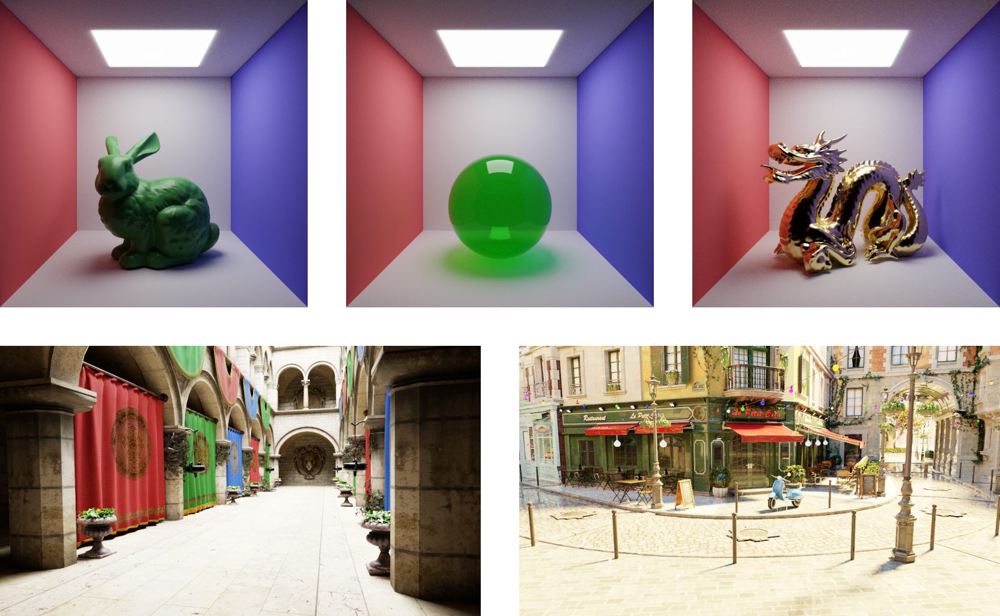

*See more screenshots in the [screenshots](screenshots) directory.*

# About

This is a GPU "software" raytracer (i.e. using manual ray-scene intersections and not RTX) written using the WebGPU API. It expects a single glTF scene as input. It supports flat-colored and textured materials with albedo, normal, and material maps. It doesn't support refraction (yet).

Note that if the input model has UVs, they should be non-degenerate, as they are used to reconstruct tangents used for normal mapping (even if the model doesn't have a normal map).

There are a bunch of test scenes in the [test_scenes](test_scenes) directory.

It uses wgpu-native WebGPU implementation, and SDL2 to create a window to render to.

This project is licensed under the terms of the MIT license.

# Usage

To run the program, first build it (see instructions below), then run it with a single glTF scene in the command arguments. For example, if you've built the project in a `build` directory inside the project root, then you can run `./webgpu-raytracer ../test_scenes/bunny/bunny_100k.gltf`.

An optional second command-line parameter defines the background of the scene. It can either be an RGB comma-separated triple like `1,0.5,0.25`, or path to an HDRI environment map. The [env_maps](env_maps) directory contains some sample environment maps.

By default, a simple preview of the scene is rendered. Press `[SPACE]` to activate raytracing.

Here are all the controls:
* Mouse (while pressing left mouse button): rotate the camera
* `[Q][E]`: roll the camera
* `[W][A][S][D][Z][X]`: move the camera
* `[LSHIFT][LCTRL]`: speed up / slow down camera controls
* `[SPACE]`: activate raytracing
* `[UP][DOWN]`: change exposure

If the camera changes in raytracing mode, the raytracing result is discarded and the preview mode is activated again (i.e. there's no temporal reprojection in this case).

# Raytracer

* The raytracer uses standard Monte-Carlo integration with multiple importance sampling, see [the corresponding shader](shaders/raytrace_monte_carlo.wgsl).
* Fast ray-scene intersections are done using a BVH built with a simple surface-area heuristic at program start (see [Jacco Bikker's amazing article series](https://jacco.ompf2.com/2022/04/13/how-to-build-a-bvh-part-1-basics/) about this).
* Raytracing uses multiple importance sampling (MIS) between several direction sampling strategies: cosine-weighted (good for diffuse materials), direct light sampling (good for rough materials), VNDF sampling (good for smooth materials), and transmission sampling (good for transparent materials). See also [my article](https://lisyarus.github.io/blog/posts/multiple-importance-sampling.html) explaining how MIS works.
* The material used is the standard glTF Cook-Torrance GGX supporting albedo, normal & material maps, with a thin-walled transmission as described by [KHR_materials_transmission](https://github.com/KhronosGroup/glTF/blob/main/extensions/2.0/Khronos/KHR_materials_transmission/README.md).
* [VNDF](https://gpuopen.com/download/publications/Bounded_VNDF_Sampling_for_Smith-GGX_Reflections.pdf) normals distribution is used to improve convergence.
* Refractive materials are not supported. I tried to incorporate refractions into VNDF sampling but never managed to figure it out; this work resides in a separate [`vndf-refraction-wip`](https://github.com/lisyarus/webgpu-raytracer/tree/vndf-refraction-wip) branch.
* NB: the `use camera.wgsl;` construct in the shaders is not standard WGSL, - instead, a rudimentary [shader importing mechanism](source/shader_registry.cpp) is implemented in this project.

# To-do list

With no promises of implementing any of this, in no particular order:
* ✅ Support environment maps & a fixed-color environment
* ✅ Sample emissive triangles in proportion to area & intensity (probably using [Vose alias method](https://en.wikipedia.org/wiki/Alias_method))
* ✅ Support albedo, material & normal maps
* Sample environment map pixels in proportion to intensity (using the same alias method)
* Implement refraction + VNDF
* Incorporate [tinybvh](https://github.com/jbikker/tinybvh) and test different BVH variants for performance
* Implement wavefront path-tracing
* Support GLB input scenes

# Building

To build this project, you need
* [CMake](https://cmake.org)
* [SDL2](https://www.libsdl.org/) (you can probably install it via your system's package manager)
* [wgpu-native](https://github.com/gfx-rs/wgpu-native)

To install wgpu-native, download [some release archive](https://github.com/gfx-rs/wgpu-native/releases) for your platform, and unpack it somewhere. This project was built with the [v0.19.4.1](https://github.com/gfx-rs/wgpu-native/releases/tag/v0.19.4.1) release, and might not work with older versions.

Don't forget to check out submodules:
* [glm](https://github.com/g-truc/glm) for vector & matrix maths
* [rapidjson](https://github.com/Tencent/rapidjson) for parsing glTF scenes
* [stb](https://github.com/nothings/stb) for loading images
* [MikkTSpace](https://github.com/mmikk/MikkTSpace) for reconstructing mesh tangents (needed for normal mapping)

You can do this at clone time, using `git clone <repo-url> --recurse-submodules`. Add `--shallow-submodules` to prevent loading the whole commit history of those submodules. Otherwise, you can checkout submodules at any time after cloning the repo with `git submodule update --init --recursive`.

Then, follow the usual steps for building something with CMake:
* Create a build directory
* In the build directory, run `cmake <path-to-webgpu-demo-source> -DWGPU_NATIVE_ROOT=<path-to-unpacked-wgpu-native>`
* Build the project: `cmake --build .`

# SDL2-wgpu

The [`include/webgpu-demo/sdl2_wgpu.h`](include/webgpu-demo/sdl_wgpu.h) and [`source/sdl2_wgpu.c`](source/sdl_wgpu.c) files implement a function `WGPUSurface SDL_WGPU_CreateSurface(WGPUInstance, SDL_Window *)` which creates a WebGPU surface from an SDL2 window, and should work on Linux (X11 and Wayland), Windows and MacOS. It is mostly based on [glfw3webgpu](https://github.com/eliemichel/glfw3webgpu/blob/main/glfw3webgpu.c).

These files are almost standalone, and can be copied directly into your project, if you want to use WebGPU with SDL2. Note that the `sdl2_wgpu.c` file needs to be compiled as Objective-C for MacOS (add `-x objective-c` to compile flags for this file), and the `QuartzCore` framework needs to be linked with your application (add `-framework QuartzCore` to your linker flags).

# wgpu-native cmake find script

The [`cmake/Findwgpu-native.cmake`](https://github.com/lisyarus/webgpu-demo/blob/main/cmake/Findwgpu-native.cmake) find script is also useful on its own, and can be used in other CMake-based projects. Simply add its location to `CMAKE_MODULE_PATH`, and call `find_package(wgpu-native)`. It creates a `wgpu-native` imported library that can be simply linked to your executable via `target_link_libraries` (it sets up include directories automatically).
